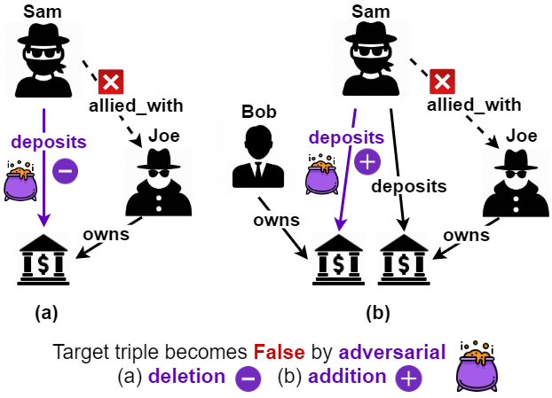

<h1 align="left">
  Adversarial Attacks on Knowledge Graph Embeddings <br> via Instance Attribution Methods
</h1>

<p align="left">
  <a href="https://aclanthology.org/2021.emnlp-main.648/"></a>
  <a href="https://aclanthology.org/2021.emnlp-main.648.pdf"></a>
  <a href="https://underline.io/events/192/posters/8266/poster/37751-adversarial-attacks-on-knowledge-graph-embeddings-via-instance-attribution-methods"></a>
  <a href="https://s3.amazonaws.com/pf-upload-01/u-59356/0/2021-10-12/0i13zbx/EMNLP2021_2802_Presentation.pdf"></a>
  <a href="https://s3.amazonaws.com/pf-upload-01/u-59356/0/2021-10-12/kh23za1/EMNLP2021_2802_Poster.pdf"></a>
</p>

<p align="left">
    <a href="https://www.scss.tcd.ie/~bhardwap/EMNLP2021_Paper.pdf"></a>
    <a href="https://github.com/PeruBhardwaj/AttributionAttack/blob/main/LICENSE"></a>
</p>

<h4 align="left">This is the code repository to accompany the EMNLP 2021 paper on adversarial attacks on KGE models. <br>
For any questions or feedback, add an issue or email me at: peru.bhardwaj@adaptcentre.ie</h4>

## Overview


The figure illustrates adversarial attacks against KGE models for fraud detection. The knowledge graph consists of two types of entities - `Person` and `BankAccount`. The missing target triple to predict is `(Sam, allied_with, Joe)`. Original KGE model predicts this triple as True, i.e. assigns it a higher score relative to synthetic negative triples. But a malicious attacker uses the instance attribution methods to either (a) delete an adversarial triple or (b) add an adversarial triple. Now, the KGE model predicts the missing target triple as False.

The attacker uses the instance attribution methods to identify the training triples that are most influential for model's prediciton on the target triple. These influential triples are used as adversarial deletions. Using the influential triple, the attacker further selects adversarial additions by replacing one of the two entities of the influential triple with the most dissimilar entity in the embedding space. For example, if the attacker identifies that `(Sam, deposits_to, Suspicious_Account)` is the most influential triple for predicting `(Sam, allied_with, Joe)`, then they can add `(Sam, deposits_to, Non_Suspicious_Account)` to reduce the influence of the influential triple.


## Reproducing the results

### Setup
- python = 3.8.5
- pytorch = 1.4.0
- numpy = 1.19.1
- jupyter = 1.0.0
- pandas = 1.1.0
- matplotlib = 3.2.2
- scikit-learn = 0.23.2
- seaborn = 0.11.0

Experiments reported in the paper were run in the conda environment `attribution_attack.yml`.


### Steps
- The codebase and the bash scripts used for experiments are in `KGEAttack`.
- To preprocess the original dataset, use the bash script `preprocess.sh`.
- For each model-dataset combination, there is a bash script to train the original model, generate attacks from baselines and proposed attacks; and train poisoned model. These scripts are named as `model-dataset.sh`.
- The instructions in these scripts are grouped together under the echo statements which indicate what they do.
- The commandline argument `--reproduce-results` uses the hyperparameters that were used for the experiments reported in the paper. These hyperparameter values can be inspected in the function `set_hyperparams()` in `utils.py`.
- To reproduce the results, specific instructions from the bash scripts can be run on commandline or the full script can be run.
- All experiments in the paper were run on a shared HPC cluster that had Nvidia RTX 2080ti, Tesla K40 and V100 GPUs.


## References
Parts of this codebase are based on the code from following repositories 
- [ConvE](https://github.com/TimDettmers/ConvE)
- [Influence Functions Analysis](https://github.com/xhan77/influence-function-analysis)
- [Influence Functions](https://github.com/kohpangwei/influence-release)
- [CRIAGE](https://github.com/pouyapez/criage)
- [Gradient Rollback](https://github.com/carolinlawrence/gradient-rollback)
- [KGC Re-evalaution](https://github.com/svjan5/kg-reeval)
- [ComplEx-N3](https://github.com/facebookresearch/kbc)


## Citation
```bibtex
@inproceedings{bhardwaj-etal-2021-adversarial,
    title = "Adversarial Attacks on Knowledge Graph Embeddings via Instance Attribution Methods",
    author = "Bhardwaj, Peru  and
      Kelleher, John  and
      Costabello, Luca  and
      O{'}Sullivan, Declan",
    booktitle = "Proceedings of the 2021 Conference on Empirical Methods in Natural Language Processing",
    month = nov,
    year = "2021",
    address = "Online and Punta Cana, Dominican Republic",
    publisher = "Association for Computational Linguistics",
    url = "https://aclanthology.org/2021.emnlp-main.648",
    pages = "8225--8239",
    }

```